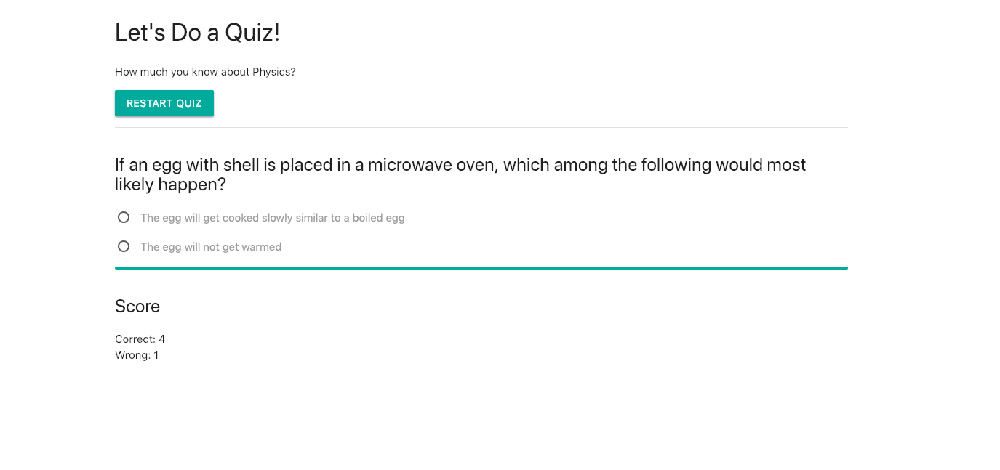

# Know_your_physics
A Quiz application where you can test your knowledge in physics and will show you the score after the test

<b> Technologies used </b> HTML, CSS, Javascript, Materialize CSS framework

<b>Description:</b> A quiz designed to test students on their knowledge of physics.
Allows users to answer questions, calculate scores, and view results.
Utilized JSON objects to store question and answers; and a scoring algorithm to tabulate results
Implemented user interface in Materialize CSS framework; using flat color schemes, grid layouts, and Material design principles. App is cross-browser compatible and mobile responsive

##Screen Shot

